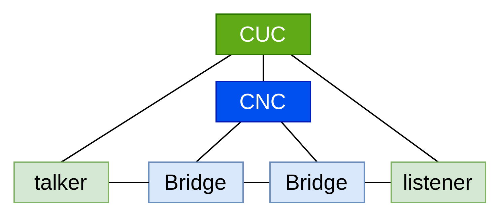

# Centralized Network Configuration for Time Sensitive Network
Fork of https://github.com/TheLondonEye700/CNC meant for development of TSN-AF.

The repository contains the basic Centralized Network Configuration (CNC) implementation for Time Sensitive Network (TSN) network management. This CNC main reponsibilities are:
- Ethernet network monitoring (switch discovery and connection) for topology drawing
- Calculate TSN-related configuration parameters and bridges communication

Note that that the original architecture involves the use of both CNC and CUC for network management. The complete architecture should be as follow:


## Installation & configuration
Base requirements:
- Python >= 3.8
- pip

Create a new virtual environment and activate it

`python3 -m venv .venv`

- Windows: `.\.venv\Scripts\activate`
- Linux: `source .venv/bin/activate`

Install the dependencies

`pip3 install -r requirements.txt`

**Behavior with package versions higher than those in requirements.txt is untested.**

The CNC works with an Ethernet network, but it can also be connected to a single TSN switch. Modify the `INTERF` variable under `bridge_discovery/sniff_lldp.py` to your connected interface. 

The CNC is configured for B&R 0ACST052.1 by default.

The application main entry point is `cnc_main.py`. After connecting a NETCONF-enabled switch to the interface specified in `INTERF` (and adjusting relevant switch-specific variables), run the program as sudo:
`sudo .venv/bin/python3 cnc_main.py`
To use virtual environment variables in sudo you need to specify the path to the environments Python executable. Sudo is needed to access port privileged port 830 (default for NETCONF via SSH). Running without sudo will terminate with OSError.

The Python program then runs continously until force stop (Ctrl+C). If the program throws an error it is supposed to recover and keep running without exiting.

## Project structure
The project is structured as followed:

```sh
.
├── cnc_main.py                  # start CNC functions as separate tasks running in parallel
├── traffic_shaper.py            # switch TSN config calculation
├── network_map.py               # network map related models and functions
├── gui                          
│   └── gui.py                   # GUI for displaying network topology
├── bridge_discovery
│   ├── sniff_lldp.py            # scapy sniffer that listens to switch LLDP broadcase
│   ├── frame_handler.py         # get switch basic information from LLDP frame
│   └── process_switch_config.py # YANG LLDP model definition for infomation retrieval
├── netconf_helper
│   ├── tsn_config.xml.py        # related XML payload and helper function
│   ├── nc_get_config.py         # NETCONF <get-config>
│   └── nc_edit_config.py        # NETCONF <edit-config>
└── setup
    └── conf.py                  # iperf3 client server pair script
```
The application starts from `cnc_main.py`, which spins up 2 tasks running asynchronously for Ethernet network map discovery and switch configuration calculation. Also note that everything under `deprecated/` and `tests/` are neither actively maintained nor used in the program.

#### Network topology
```sh
.
└── bridge_discovery/
```
For switch discovery, the CNC use tool `scapy` to listen to LLDP frames that swich advertises. After extracting switch name and IP address from such frames, CNC makes NETCONF request for detailed topology knowledge (switch's capability, ports and connection). All these information are saved into the common `NetworkMap` model.


#### TSN switch configuration
```sh
.
└── traffic_shaper.py
```

The standard IEEE terms for this functionality is traffic shaping. When there are changes to network map and it has complete drawing the topology, information are extracted to calculate QBV parameters. These parameters include:
- Port gate cycle time
- Gate control list entry
- Offset of ingress and egress port for each traffic node

## GUI
The GUI uses Tkinter, which is built into python, but if missing can be installed eg. with `sudo apt-get install python3.10-tk` for python3.10.

It can be ran separately from the main CNC functions from the `gui/gui.py` file.
```sh
python3 -m gui.gui gui/gui.py
```

## TODO
- [ ] Verify GUI working
- [ ] Set up config.py to centralize user environment variables
- [ ] Add time synchronization feedback
- [ ] Add easy multi-switch control
- [ ] Add unit testing